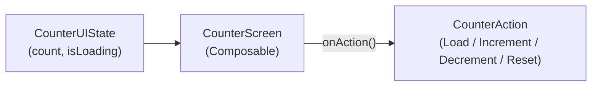
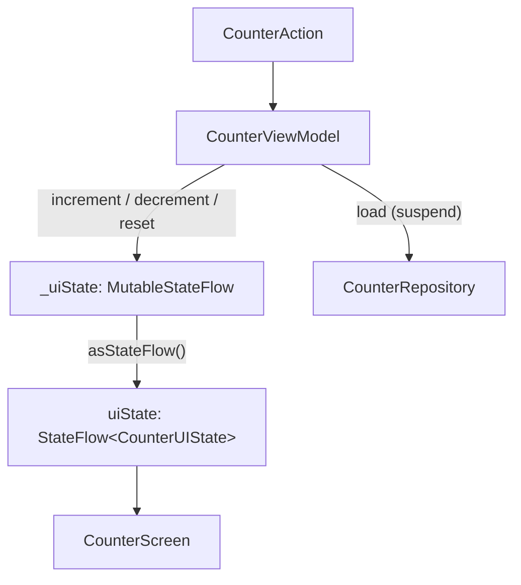
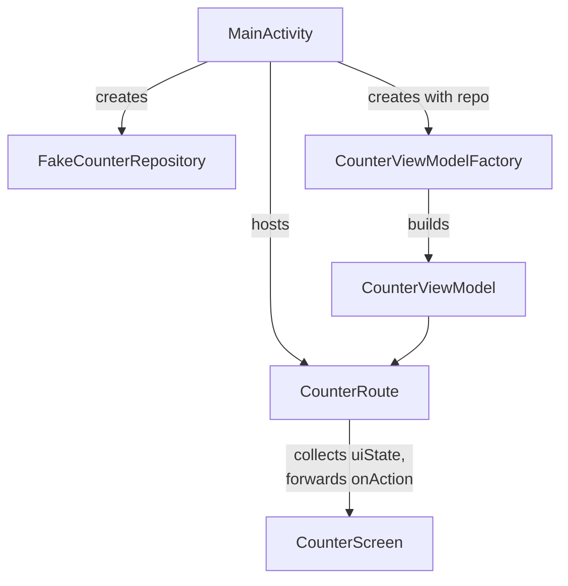

# MinimalMVVM

A learning project exploring a minimal MVVM architecture on Android using Jetpack Compose — built as a simple counter app.

## The Journey So Far

- **Scaffold** — Started from an empty Android Studio activity template.
- **Compose UI** — Wired up a basic Compose UI in `MainActivity`.
- **ViewModel** — Introduced `CounterViewModel` to hold and manage counter state outside the UI layer.
- **Layout polish** — Centered the content in the counter screen.
- **Increment button** — Added a button to increment the counter.
- **UI State** — Introduced a `CounterUIState` data class to represent the screen's state explicitly, rather than passing loose values.
- **Actions as a sealed interface** — Refactored user intents into a `CounterAction` sealed interface, and optimized the Compose screen to react to state/actions cleanly.
- **Unit tests** — Added an extensive test suite for `CounterViewModel` to lock in behavior.
- **Repository pattern + coroutines** — Introduced `CounterRepository` (with a `FakeCounterRepository` for testing) and moved counter logic behind a suspending, coroutine-based API.
- **ViewModel factory** — Added `CounterViewModelFactory` using `viewModel()` with a factory to construct the `CounterViewModel` and inject its dependencies.
- **Loading state** — Extended `CounterUIState` and `CounterAction` to represent and handle a loading state, and wired the updated flow into `MainActivity`.

## Structure

- `CounterUIState.kt` — Immutable state representation for the counter screen, including loading state.
- `CounterAction.kt` — Sealed interface of user actions/intents.
- `CounterViewModel.kt` — Holds state, handles actions, delegates to the repository, exposes state to the UI.
- `CounterViewModelFactory.kt` — Builds `CounterViewModel` with its repository dependency injected.
- `CounterRepository.kt` — Repository abstraction for counter data, backed by coroutines.
- `FakeCounterRepository.kt` — In-memory fake repository used for testing.
- `CounterScreen.kt` — Compose UI that renders state and dispatches actions.
- `MainActivity.kt` — Hosts the Compose screen and wires up the ViewModel factory.

## Architecture

Each diagram covers one layer in isolation to keep things easy to follow.

### Presentation — UI

`CounterScreen` is a pure function of state: it renders `CounterUIState` and emits `CounterAction`s. It has no knowledge of the ViewModel, repository, or coroutines.



### Presentation — State Holder

`CounterViewModel` owns the single source of truth for the screen. It receives actions, mutates state via `MutableStateFlow`, and exposes an immutable `StateFlow` for the UI to observe.



### Data — Repository

`CounterRepository` is the abstraction the ViewModel depends on. `FakeCounterRepository` is today's in-memory implementation, standing in for a future real data source (network, database, etc.).

```mermaid
flowchart LR
    VM["CounterViewModel"] --> Interface["CounterRepository<br/>(interface)"]
    Interface <|.. Fake["FakeCounterRepository<br/>(suspend getCount)"]
```

### Composition Root — Wiring It Together

`MainActivity` is where concrete dependencies are created and handed to the `ViewModelFactory`, keeping construction logic out of the ViewModel itself.


